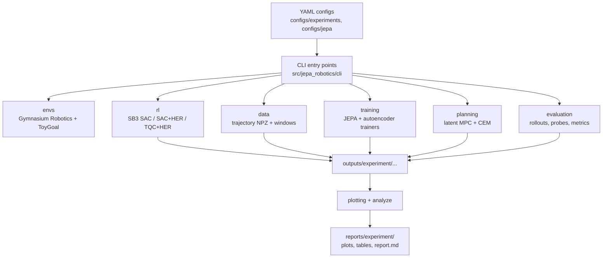
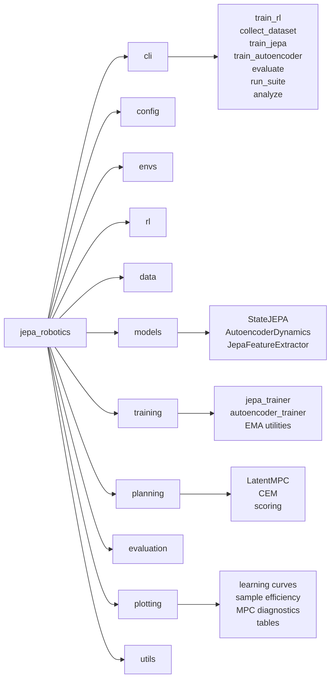
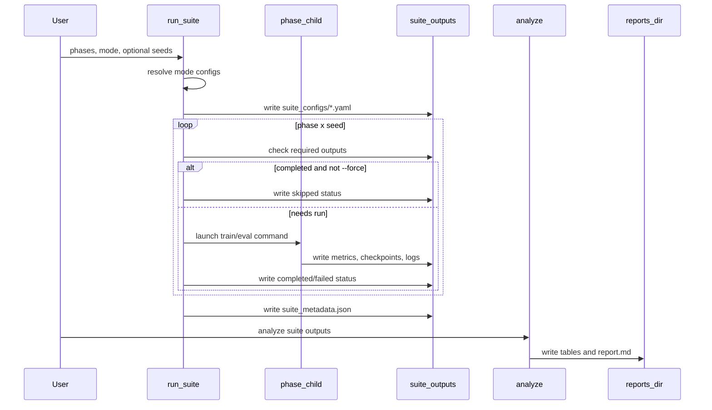
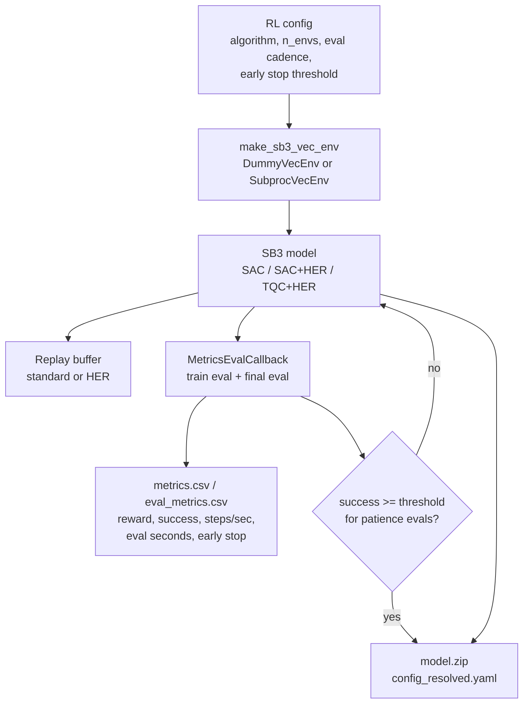
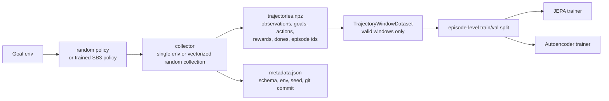
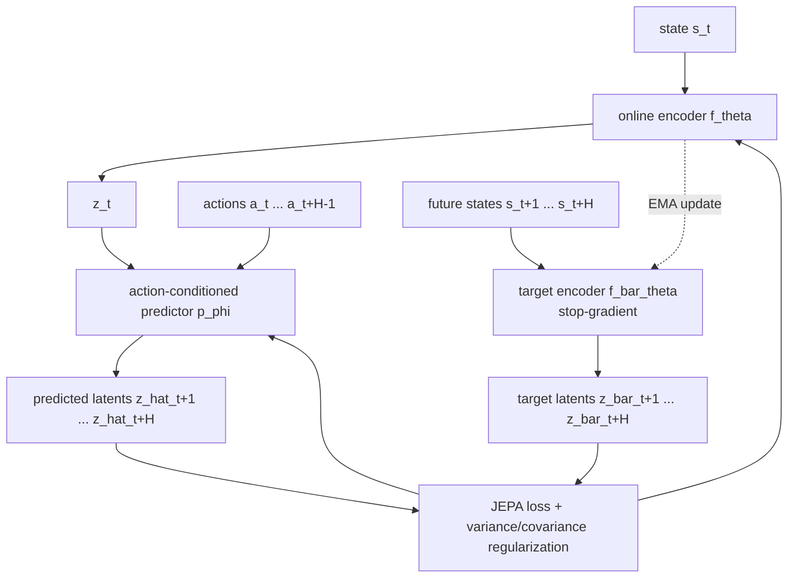
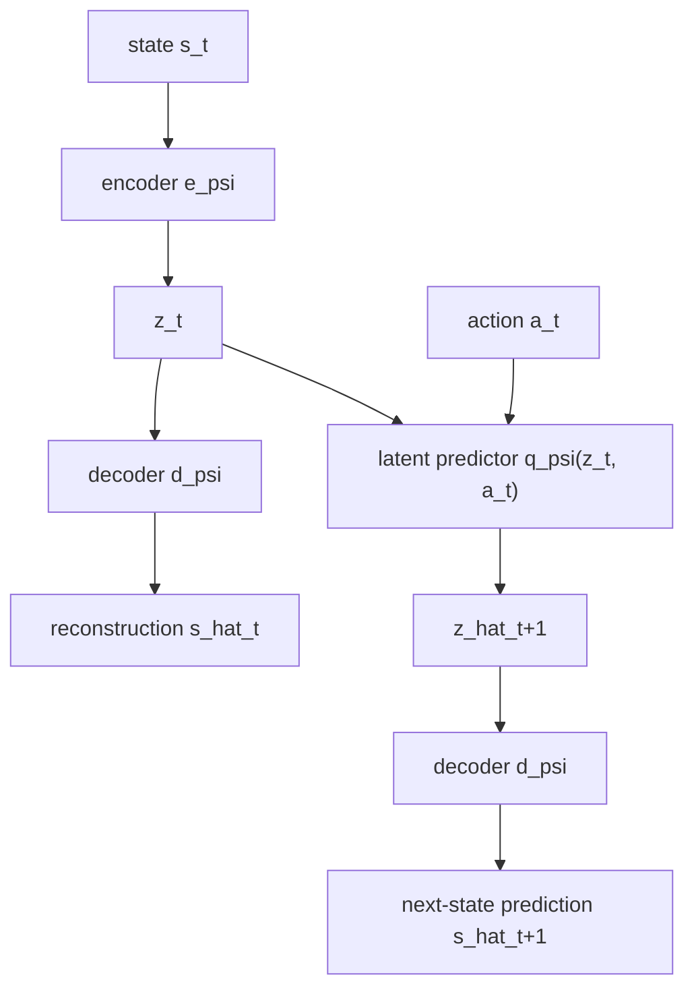
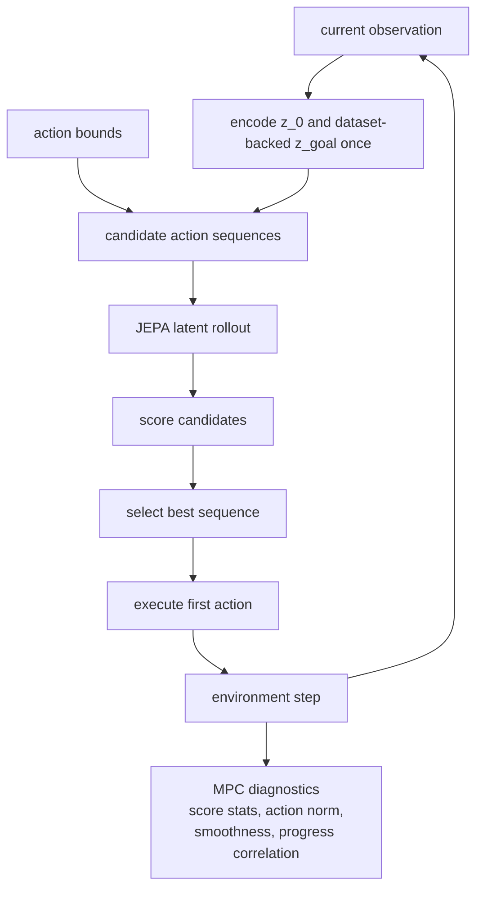
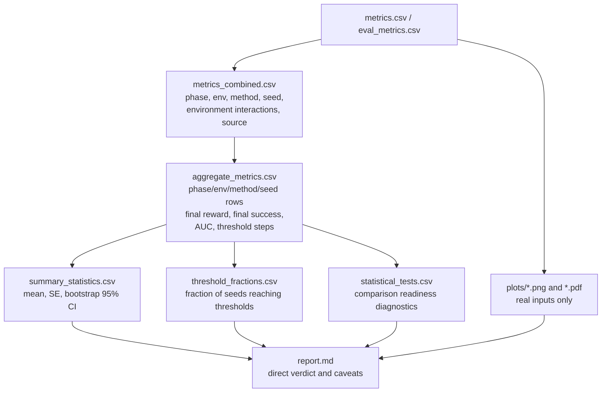

# JEPA Robotics Benchmark Harness

This repository compares classic model-free reinforcement learning baselines with JEPA-style latent predictive world models on goal-conditioned robotics tasks. The first maintained path is state-based Fetch reaching/pushing, with a deterministic `ToyGoal-v0` smoke path for fast CI and local validation.

## Status

Scaffold is ready, full results pending, current `reports/` are pipeline validation. Do not treat
the checked-in workflow or current local reports as evidence that JEPA improves robotics sample
efficiency yet.

## Install

Use `uv` for all environment management:

```bash
uv sync
```

The project targets Python `>=3.11,<3.13` and uses a local `.venv` created by `uv`.

## Quickstart Smoke Run

These commands run on CPU without CUDA/MPS and use tiny budgets:

```bash
uv run python -m jepa_robotics.cli.run_suite \
  --mode iteration \
  --phases phase1_fetch_reach \
  --max-parallel 2 \
  --smoke-test

uv run python -m jepa_robotics.cli.train_rl --config configs/experiments/phase1_fetch_reach.yaml --smoke-test
uv run python -m jepa_robotics.cli.collect_dataset --config configs/experiments/phase1_fetch_reach.yaml --smoke-test
uv run python -m jepa_robotics.cli.train_jepa --config configs/jepa/state_jepa.yaml --smoke-test
uv run python -m jepa_robotics.cli.train_autoencoder --config configs/jepa/autoencoder.yaml --smoke-test
uv run python -m jepa_robotics.cli.evaluate --config configs/jepa/jepa_mpc.yaml --smoke-test
uv run python -m jepa_robotics.cli.plot --experiment outputs/smoke
uv run python -m jepa_robotics.cli.analyze --experiment outputs/smoke
```

The top-level module aliases also work for the core commands, for example:

```bash
uv run python -m jepa_robotics.train_rl --config configs/experiments/phase1_fetch_reach.yaml --smoke-test
uv run python -m jepa_robotics.train_jepa --config configs/jepa/state_jepa.yaml --smoke-test
uv run python -m jepa_robotics.evaluate --config configs/jepa/jepa_mpc.yaml --smoke-test
uv run python -m jepa_robotics.plot --experiment outputs/smoke
```

## Technical Design

The benchmark is organized as a reproducible experiment system rather than a single training
script. Config files define the environment, data, model, planner, device, and output layout;
CLI entry points resolve those configs and call library modules; all long-running artifacts are
written under `outputs/` and analyzed into `reports/`.



### Repository Map



### End-to-End Experiment Flow

The suite driver is the orchestration layer. It creates a resolved config for each
`(phase, seed)` pair, launches children with bounded parallelism, skips completed outputs, and
stores status/provenance.



### RL Baseline Pipeline

Dense Fetch tasks use SAC. The primary contact task is `FetchPushDense-v4`, which gives a shaped
object-control signal. Sparse Push remains a stress test using SAC or TQC with HER replay. Training
uses SB3 vector environments, periodic cheap evaluations, a final full evaluation, optional early
stopping, and timing metrics.



The main RL objective is the standard discounted return:

```math
J(\pi) = \mathbb{E}_{\tau \sim \pi}\left[\sum_{t=0}^{T-1} \gamma^t r_t\right]
```

For goal-conditioned sparse tasks with HER, transitions are relabeled with alternate goals:

```math
(s_t, a_t, r_t, g) \rightarrow (s_t, a_t, r(s_{t+1}, g'), g')
```

### Dataset and Windowing Pipeline

Trajectory collection stores explicit, versioned NPZ arrays. JEPA and autoencoder training consume
fixed-horizon windows that are guaranteed not to cross episode, terminal, or truncation boundaries.



A valid window starting at index `i` with horizon `H` must satisfy:

```math
\mathrm{episodeId}_{i+k} = \mathrm{episodeId}_i,\quad k=0,\dots,H
```

and no interior transition may terminate or truncate:

```math
\neg\left(\mathrm{terminated}_{i+k} \lor \mathrm{truncated}_{i+k}\right),
\quad k=0,\dots,H-1
```

### State JEPA Model

The state JEPA path learns an action-conditioned latent dynamics model. The online encoder and
predictor receive gradients; the target encoder is updated only by exponential moving average.



For a trajectory window, the target latents are:

```math
\bar{z}_{t+h} = \bar{f}_{\theta}(s_{t+h}),\quad h \in \{1,\dots,H\}
```

The predictor rolls forward in latent space:

```math
\hat{z}_{t+h} = p_{\phi}(\hat{z}_{t+h-1}, a_{t+h-1}),\quad \hat{z}_t = f_{\theta}(s_t)
```

The core predictive loss uses cosine distance with stop-gradient targets:

```math
L_{\text{pred}} =
\frac{1}{H}\sum_{h=1}^{H}
\left(2 - 2\cdot
\frac{\hat{z}_{t+h}^{\top}\operatorname{sg}(\bar{z}_{t+h})}
{\|\hat{z}_{t+h}\|_2\|\operatorname{sg}(\bar{z}_{t+h})\|_2}
\right)
```

The target encoder update is EMA-only:

```math
\bar{\theta} \leftarrow m\bar{\theta} + (1-m)\theta
```

The implemented total loss is:

```math
L = L_{\text{pred}} + \lambda_{\text{var}}L_{\text{var}} +
\lambda_{\text{cov}}L_{\text{cov}}
```

where `L_var` discourages latent collapse and `L_cov` penalizes off-diagonal covariance.

### Autoencoder Baseline

The autoencoder baseline provides a representation-learning control condition: it learns to
reconstruct the current state and predict the next state through a latent dynamics step.



The autoencoder objective is:

```math
L_{\text{AE}} =
\|d_{\psi}(e_{\psi}(s_t)) - s_t\|_2^2
+ \beta\|d_{\psi}(q_{\psi}(e_{\psi}(s_t), a_t)) - s_{t+1}\|_2^2
```

### Latent MPC Controller

JEPA-MPC uses the trained JEPA model as a latent world model. At each environment step it samples
or optimizes candidate action sequences, scores the terminal latent against a dataset-backed goal
state, executes only the first action, and replans on the next state.



The planner score for a candidate sequence `A = (a_0,\dots,a_{H-1})` is:

```math
\operatorname{score}(A) =
-\left(\|\hat{z}_{H}(A)-z_{\text{goal}}\|_2^2
+ \lambda_a\sum_{h=0}^{H-1}\|a_h\|_2^2\right)
```

CEM updates a Gaussian action distribution from elite sequences:

```math
\mu \leftarrow \frac{1}{K}\sum_{i \in \mathcal{E}} A_i,\quad
\sigma \leftarrow \max\left(\operatorname{std}_{i \in \mathcal{E}}(A_i), \sigma_{\min}\right)
```

### Analysis and Reporting

Analysis is designed to be reproducible from saved logs. It does not depend on live training
objects.



Success AUC is computed from saved evaluation points. For sample-efficiency plots, the x-axis is
`environment_interactions`, not raw learner updates. Plain RL methods use `global_step`.
JEPA-backed methods add the configured dataset-collection cost:

```math
\mathrm{environmentInteractions} =
\mathrm{globalStep} +
\mathbf{1}_{\text{JEPA/AE-backed}}\cdot
(\mathrm{datasetEpisodes}\times \mathrm{episodeSteps})
```

This counts collection cost for JEPA-MPC and JEPA-feature RL before their first evaluation point.
When collection uses a saved policy checkpoint, dataset metadata also records `policy_source_path`
and `policy_source_steps` from the source policy's `config_resolved.yaml`; analysis adds that
source-policy training cost to the interaction budget when the artifact is available.

```math
\operatorname{AUC}_{\text{success}} =
\int_0^T \operatorname{success}(t)\,dt
```

The normalized AUC used for cross-run comparison is:

```math
\operatorname{nAUC}_{\text{success}} =
\frac{\operatorname{AUC}_{\text{success}}}{T}
```

## Experiment Suites and Runtime Tiers

The suite driver launches one subprocess per `(phase, seed)` pair, caps concurrency with
`--max-parallel`, records suite metadata, skips completed children by default, and writes both
analysis tables and plots under `reports/<suite>/` after the suite completes. Suite phases run in
dependency waves where needed: `jepa_sac` waits for same-seed `state_jepa` when both phases are in
the same suite, so the feature-SAC phase can use the freshly trained encoder.

```bash
uv run python -m jepa_robotics.cli.run_suite \
  --mode iteration \
  --phases phase1_fetch_reach phase3_fetch_push_dense \
  --max-parallel 2
```

Suites default to `--seeds 0`. Pass explicit seeds, for example `--seeds 0 1 2`,
when you want confirm evidence. Treat publishable claims as requiring at least five seeds per
method in the same phase/environment with matched budgets. Use `--force` to rerun completed
outputs. Status and provenance files are written under:

```text
outputs/<mode>_suite/
  suite_metadata.json
  suite_status/<phase>_seed_<seed>.json
  suite_configs/<phase>_seed_<seed>.yaml
```

Pass `--no-report` only when you want to defer plot/table generation.

Runtime tiers live in:

```text
configs/experiments/iteration/
configs/experiments/matched/
configs/experiments/confirm/
configs/experiments/full/
```

Benchmark interpretation is intentionally conservative:

- `FetchReachDense-v4` is a sanity-check task for wiring, stability, and obvious regressions.
- `FetchPushDense-v4` and sparse `FetchPush-v4` are the harder benchmark tasks.
- Dense Fetch tasks use SAC baselines. Sparse Fetch tasks use goal-conditioned
  SAC+HER and TQC+HER style baselines.
- Do not report a method improvement unless the report has matched phase/environment rows,
  enough seeds per method, and comparable interaction budgets.

Iteration configs are for local development. Confirm and full configs are resumable real-task
runs, but they are not automatically publishable: the suite CLI default remains one seed unless
you pass explicit seeds.

The Stage 1 reach-only demonstration suite keeps the environment fixed to `FetchReachDense-v4`
and runs the full wiring path before moving to Push:

```bash
uv run python -m jepa_robotics.cli.run_suite \
  --mode full \
  --phases stage1_fetch_reach \
  --max-parallel 2 \
  --output-dir outputs/stage1_fetch_reach_full

uv run python -m jepa_robotics.cli.render_rollouts \
  --experiment outputs/stage1_fetch_reach_full \
  --methods sac sac_jepa jepa_mpc \
  --episodes 3 \
  --output-dir outputs/stage1_fetch_reach_full/videos

uv run python -m jepa_robotics.render_rollouts \
  --experiment outputs/stage1_fetch_reach_full \
  --methods jepa_mpc \
  --episodes 3 \
  --budget 1920
```

`stage1_fetch_reach` expands to `phase1_fetch_reach state_jepa jepa_sac jepa_mpc`. This gives one
plain SAC baseline, one random-trajectory JEPA pretraining run, one frozen-JEPA SAC run, one
JEPA-MPC evaluation, and the standard report artifacts under the suite output directory. Use
additional seeds only after the one-seed run is clean.

The compact matched-budget validation suite is:

```bash
uv run python -m jepa_robotics.cli.run_suite \
  --mode matched \
  --phases phase1_fetch_reach state_jepa jepa_sac jepa_mpc phase3_fetch_push_dense \
  --max-parallel 3 \
  --output-dir outputs/matched_reach_dense_6k
```

The Reach comparison uses `comparison_group: reach_dense_matched_6k`: SAC gets 6k RL
interactions; JEPA-feature SAC gets 5k dataset interactions plus 1k RL interactions; JEPA-MPC
gets 5k dataset interactions plus 1k evaluation interactions. This suite verifies budget
accounting and analysis behavior; it is not a final Fetch performance benchmark.

The full Reach sanity-check suite defaults to one seed and uses `comparison_group: reach_dense_full_100k`:
plain SAC gets 100k RL interactions, JEPA-feature SAC gets 50k random
dataset interactions plus 50k RL interactions, and JEPA-MPC sweeps 400, 1000, and 1920 dataset
episodes. Dense Push full configs use `comparison_group: push_dense_full_50k` for the SAC
baseline.

## RL Baselines

Dense Fetch tasks use SAC. The default contact-control comparison is dense Push:

```bash
uv run python -m jepa_robotics.cli.train_rl \
  --config configs/experiments/phase1_fetch_reach.yaml \
  --method sac \
  --seed 0

uv run python -m jepa_robotics.cli.train_rl \
  --config configs/experiments/phase3_fetch_push_dense.yaml \
  --method sac \
  --seed 0
```

Sparse Push is retained as a stress test, not the primary Phase 3 benchmark. It uses HER replay,
with an optional TQC+HER comparison phase using `sb3-contrib`:

```bash
uv run python -m jepa_robotics.cli.train_rl \
  --config configs/experiments/phase3_fetch_push_sparse.yaml \
  --method sac_her \
  --seed 0

uv run python -m jepa_robotics.cli.train_rl \
  --config configs/experiments/full/phase3_fetch_push_sparse_tqc.yaml \
  --method tqc_her \
  --seed 0
```

RL outputs are written under:

```text
outputs/<experiment>/rl/<method>/seed_<seed>/
  model.zip
  monitor.csv
  eval_metrics.csv
  metrics.csv
  config_resolved.yaml
  stdout.log
  stderr.log
```

RL configs support speed controls:

```yaml
rl:
  n_envs: 2
  vec_env_type: dummy
  train_eval_episodes: 20
  final_eval_episodes: 20
  early_stop_success: 0.95
  early_stop_patience: 3
  skip_existing: true
```

Sparse FetchPush stress configs use RL Zoo-style HER controls:

```yaml
rl:
  total_timesteps: 1000000
  learning_rate: 0.001
  batch_size: 512
  gamma: 0.98
  tau: 0.005
  policy_net_arch: [512, 512, 512]
  n_critics: 2
  time_feature_wrapper: true
  replay_buffer_class: HerReplayBuffer
  replay_buffer_kwargs:
    n_sampled_goal: 4
    goal_selection_strategy: future
```

Training-time evaluations use `train_eval_episodes`; the final row uses
`final_eval_episodes`. `metrics.csv` records wall-clock timing, eval seconds, steps/sec,
and early-stop state.

## Dataset Collection

Collect trajectories from a random, RL, or mixture policy:

```bash
uv run python -m jepa_robotics.cli.collect_dataset \
  --config configs/experiments/phase1_fetch_reach.yaml \
  --policy outputs/phase1_fetch_reach/rl/sac/seed_0/model.zip \
  --seed 0
```

Datasets use a documented compressed NPZ schema plus `metadata.json`:

```text
observations, achieved_goals, desired_goals, actions, rewards,
terminated, truncated, episode_ids, timestep_ids
```

The dataset `metadata.json` includes provenance fields such as `collector_n_envs`,
`collector_vec_env_type`, `policy_source_path`, and `policy_source_steps`. `policy_source_steps`
is zero for random collection and is populated from the source policy's resolved config when a
policy checkpoint is supplied.

Random-policy collection can use multiple vectorized workers:

```yaml
dataset:
  n_envs: 4
  vec_env_type: dummy
  skip_existing: true
```

Window generation for JEPA training is vectorized and rejects windows that cross episode,
terminal, or truncation boundaries.

## Train JEPA

```bash
uv run python -m jepa_robotics.cli.train_jepa \
  --config configs/jepa/state_jepa.yaml \
  --dataset outputs/phase1_fetch_reach/datasets/FetchReachDense-v4/mixture/seed_0/trajectories.npz \
  --seed 0
```

JEPA outputs:

```text
encoder.pt
target_encoder.pt
predictor.pt
normalizer.pkl
train_metrics.csv
val_metrics.csv
config_resolved.yaml
```

`normalizer.pkl` stores `schema_version=normalizer_v1` and a `RunningNormalizer` object.
`train_metrics.csv` and `val_metrics.csv` are split by held-out episode IDs and include
per-horizon cosine similarity and prediction MSE columns such as
`cosine_similarity_h1` and `prediction_mse_h4`.

JEPA configs also expose DataLoader and optional accelerator knobs:

```yaml
jepa:
  validation_fraction: 0.2
  num_workers: 0
  pin_memory: false
  persistent_workers: false
  compile_model: false
  amp: false
```

AMP and compile are off by default.

## Train Autoencoder Baseline

```bash
uv run python -m jepa_robotics.cli.train_autoencoder \
  --config configs/jepa/autoencoder.yaml \
  --dataset outputs/state_jepa/datasets/FetchReachDense-v4/random/seed_0/trajectories.npz \
  --seed 0
```

Autoencoder outputs:

```text
encoder.pt
decoder.pt
predictor.pt
train_metrics.csv
val_metrics.csv
config_resolved.yaml
```

## Evaluate JEPA-MPC

```bash
uv run python -m jepa_robotics.cli.evaluate \
  --config configs/jepa/jepa_mpc.yaml \
  --checkpoint outputs/state_jepa/jepa/state_jepa/seed_0/encoder.pt \
  --dataset outputs/state_jepa/datasets/FetchReachDense-v4/random/seed_0/trajectories.npz \
  --seed 0
```

The planner supports random shooting and CEM. During evaluation it builds a goal bank from the
trajectory dataset and encodes the real stored state whose achieved goal is nearest the desired
goal, instead of scoring against a fabricated target state. It logs planning time, selected action
norm, predicted latent distance, actual goal distance, nearest dataset-goal distance, goal-source,
reward, and success metrics.
It also records action smoothness, candidate score summary statistics, actual goal progress,
and predicted-vs-actual progress correlation in `mpc_diagnostics.csv` and
`mpc_summary.csv`.

JEPA-MPC configs can set `mpc.dataset_budgets` to evaluate multiple prefixes of the same collected
dataset. Each budget writes its own sliced dataset and JEPA checkpoint under:

```text
outputs/<experiment>/mpc/jepa_mpc/seed_<seed>/budget_<episodes>/
  trajectories.npz
  jepa/
```

The combined `metrics.csv`, `eval_metrics.csv`, `mpc_diagnostics.csv`, and `mpc_summary.csv`
include `budget_episodes`; JEPA-MPC metric rows also record `pretraining_env_steps` and
`configured_environment_budget`.

## JEPA-Pretrained SAC

SAC can be run with a frozen or fine-tuned JEPA encoder feature extractor:

```bash
uv run python -m jepa_robotics.cli.train_rl \
  --config configs/experiments/phase1_fetch_reach.yaml \
  --method sac_jepa \
  --feature-extractor jepa \
  --encoder-checkpoint outputs/state_jepa/jepa/state_jepa/seed_0/encoder.pt \
  --freeze-encoder \
  --seed 0
```

Use `--fine-tune-encoder` instead of `--freeze-encoder` to allow policy gradients to update
the encoder.

## Plot and Analyze

Plots are generated from saved CSV logs, never from live training objects or synthetic stand-ins:

```bash
uv run python -m jepa_robotics.cli.analyze --experiment outputs/phase1_fetch_reach
uv run python -m jepa_robotics.cli.plot --experiment outputs/phase1_fetch_reach
```

Reports are written under:

```text
reports/<experiment>/
  report.md
  artifact_manifest.csv
  metrics_combined.csv
  plots/*.png
  plots/*.pdf
  tables/aggregate_metrics.csv
  tables/robust_summary.csv
  tables/threshold_metrics.csv
  tables/statistical_tests.csv
```

`analyze` and `plot` both regenerate the same report directory. `analyze` returns the tables path;
`plot` returns the report path. The combined metrics file preserves:

```text
phase, env_id, method, seed, reward_mode, total_steps, source_path
dataset_source, pretraining_env_steps, environment_interactions
policy_source_steps, configured_environment_budget
```

Aggregate, summary, threshold, and comparison-readiness tables keep phase/environment context so
`FetchReachDense-v4` SAC and `FetchPushDense-v4` SAC are not collapsed into a single `sac` row.

Optional diagnostic plots are generated only from real inputs:

```text
JEPA loss/horizon/latent plots: train_metrics.csv and val_metrics.csv
MPC plots: mpc_diagnostics.csv
probe plots: probe_metrics.csv or probes.csv
generalization heatmaps: generalization_metrics.csv
```

When those files are absent, `artifact_manifest.csv` and `report.md` mark the diagnostics as
missing/not run instead of creating placeholder figures. Core sample-efficiency plots still come
from `metrics.csv` / `eval_metrics.csv`.

The report directory includes:

```text
tables/summary_statistics.csv
tables/threshold_fractions.csv
report.md
```

The summary table includes mean, SE, and bootstrap 95% CI by phase, environment, and method.
`robust_summary.csv` adds median, IQM, and bootstrap IQM intervals for seed-level metrics.
`statistical_tests.csv` is deliberately a readiness diagnostic, not a p-value table. It marks
whether each comparison group/environment has at least two methods, approximately matched
`configured_environment_budget`, and at least five seeds per method. Budgets within 1% are treated
as matched to avoid false negatives from small accounting differences. Do not name a winner across
environments, unrelated comparison groups, unmatched budgets, or single-seed runs.

Minimum defensible comparison design:

- Pick one environment per claim, such as `FetchReachDense-v4` for a sanity check or
  `FetchPush-v4` with HER/TQC+HER for a hard sparse-goal task.
- Use matched environment-interaction budgets for every method in that claim.
- Include JEPA dataset collection cost, plus recorded source-policy training cost when present,
  on the x-axis.
- Use at least five seeds and report robust aggregate summaries before making sample-efficiency
  claims.
- Generate real diagnostics or mark them missing; do not substitute placeholder plots.

## Configs

All runs are config-driven. Key configs live in:

```text
configs/env/
configs/rl/
configs/jepa/
configs/experiments/
```

Each run copies the resolved config into its output directory and does not mutate the source YAML.

## Device Handling

All PyTorch code uses:

```python
get_torch_device(preferred: str = "auto")
```

`auto` tries CUDA, then MPS, then CPU. Explicit `cuda` or `mps` requests fail clearly if unavailable.

## Quality Gates

Run the required gate before considering changes complete:

```bash
uv run ruff check .
uv run ruff format --check .
uv run pytest --cov=src/jepa_robotics --cov-report=term-missing --cov-fail-under=90
uv run mypy src tests
```

Apply formatting with:

```bash
uv run ruff format .
```

## Full Experiment Scripts

The shell scripts preserve the intended real-run workflow:

```bash
bash scripts/train_baselines.sh
bash scripts/train_jepa.sh
bash scripts/make_all_plots.sh
```

## Performance Measurement

Smoke-scale measurements for this enhancement work can be regenerated with:

```bash
uv run python scripts/benchmark_training_enhancements.py
```

The script writes:

```text
reports/training_performance_enhancements/measurement.md
reports/training_performance_enhancements/measurement.json
```

These are local smoke measurements. Use the suite driver in confirm or full mode for real Fetch
runtime and quality claims.

## Troubleshooting

MuJoCo and Gymnasium Robotics: run `uv sync` and confirm the Fetch env can be imported with `uv run python -c "import gymnasium_robotics"`.

Current Gymnasium Robotics releases use Fetch `-v4` IDs. Repo configs use explicit `-v4`
environment names; the environment factory still resolves older Fetch `-v3` IDs to installed
`-v4` environments for backward compatibility.

CUDA: use `device.preferred: cuda` only when `torch.cuda.is_available()` is true.

MPS: use `device.preferred: mps` only on Apple Silicon with PyTorch MPS support. Use `auto` for CUDA -> MPS -> CPU selection.

Long training times: start with `--smoke-test`, then `configs/experiments/phase0_reacher_debug.yaml`, then the real phase configs.
